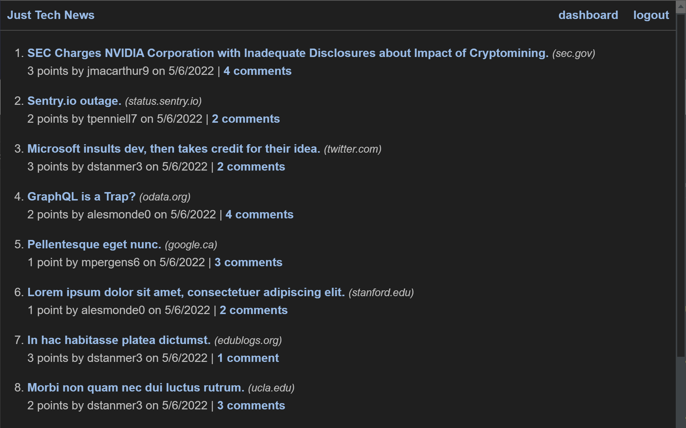

# Title
Tech News Clone

## Description
Web application for users to post and view tech related articles from anywhere on the web!

## Table of Contents
* [Installation](#installation)
* [Usage](#usage)
* [Contributors](#contributors)
* [Tests](#tests)
* [Questions](#questions)
* [License](#license) 

## Installation
Run npm i to install all the dependencies in package.json, then run npm start to run locally @ localhost:3001.

## Usage
This application has a wide use scenario, and could be run from within another application, or website. Screenshot is added below.

## Contributors
None

## Tests
Tests within thje application were run using jest.

Contact information (email address & GitHub username) of the developer
## Questions
kevin.o.foreman2@gmail.com / kevin-foreman (GitHub)

## License

The license used for this project is MIT

Screenshot

